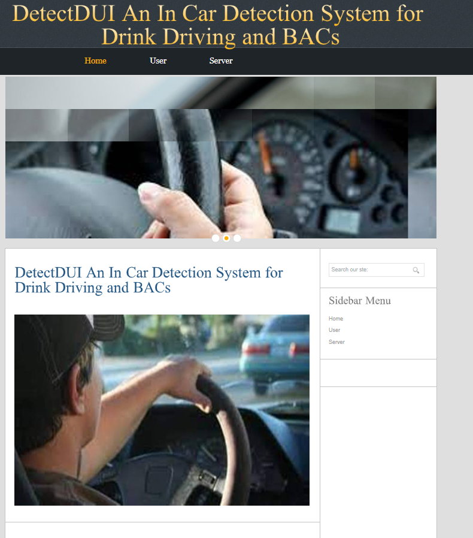
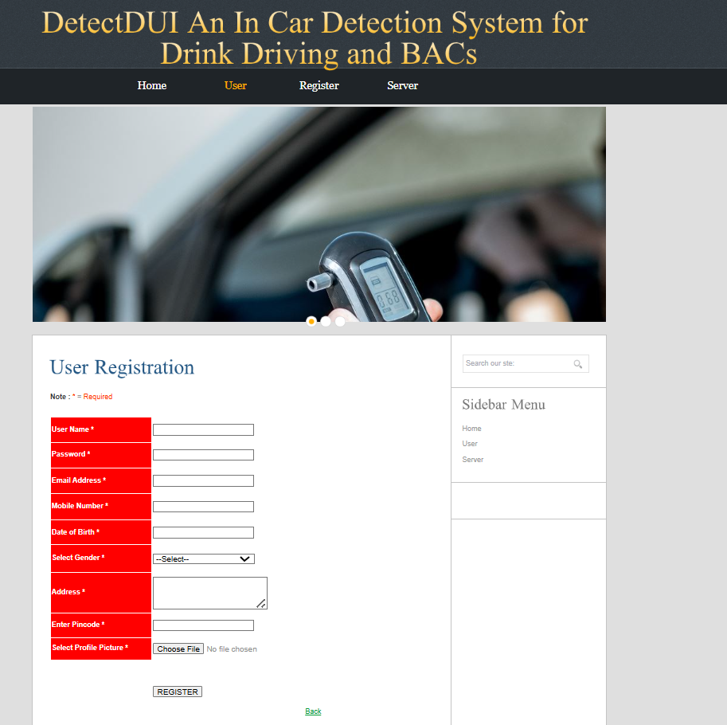
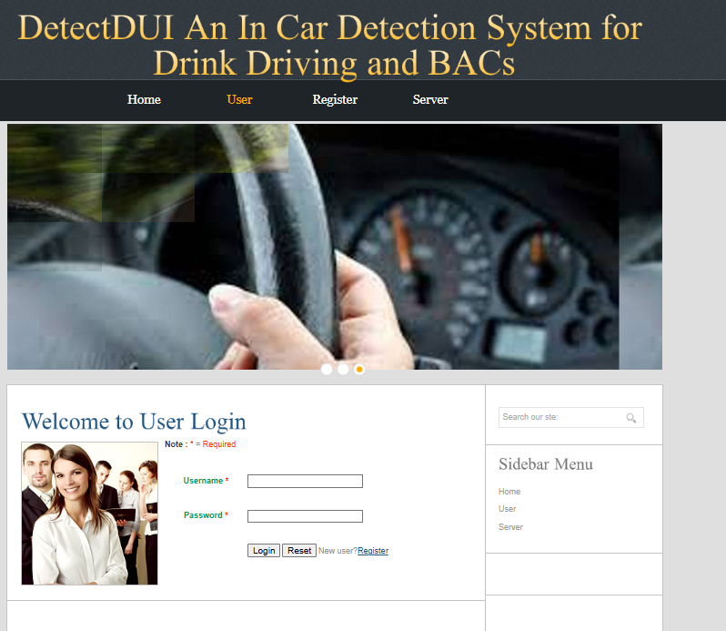
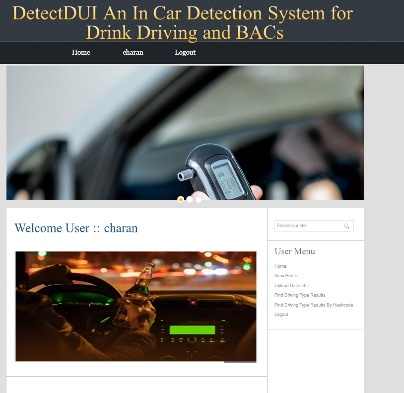
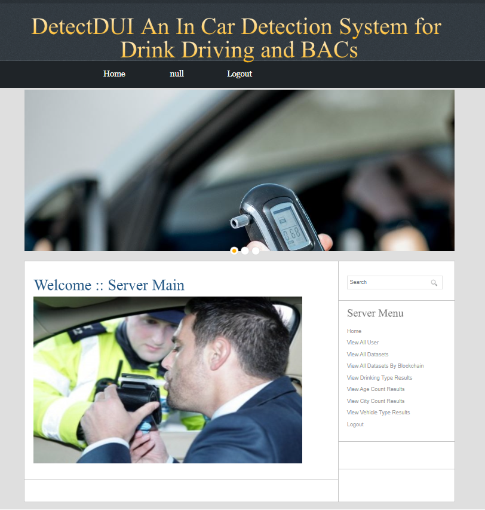
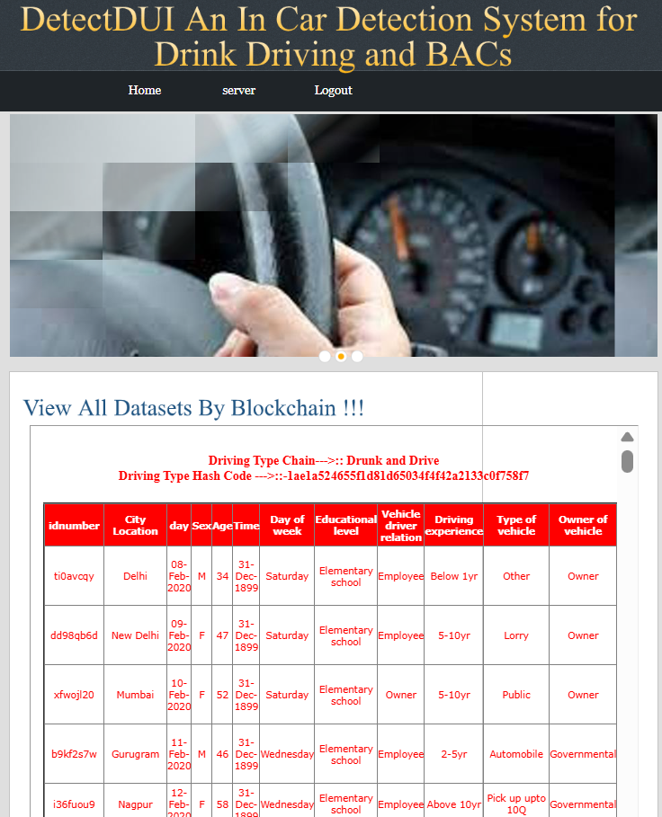

# Detect-DUI-an-in-car-detection-system-for-drink-driving-ad-BACS

<h2>Objective:</h2>

As one of the biggest contributors to road accidents and fatalities, drink driving is worthy of significant research attention. However, most existing systems on detecting or preventing drink driving either require special hardware or require much effort from the user, making these systems inapplicable to continuous drink driving monitoring in a real driving environment. In this paper, we present DetectDUI, a contactless, non-invasive, real-time system that yields a relatively highly accurate drink driving monitoring by combining  vital signs (heart rate and respiration rate) extracted from in-car WiFi system and driver’s psychomotor coordination through steering wheel operations. The framework consists of a series of signal processing algorithms for extracting clean and informative vital signs and psychomotor coordination, and integrate the two data streams using a self-attention convolutional neural network (i.e., C-Attention). In safe laboratory experiments with 15 participants, DetectDUI achieves drink driving detection accuracy of 96.6% and BAC predictions with an average mean error of 2 _ 5mg/dl. These promising results provide a highly encouraging case for continued development.

<h2>Softwares Installations:</h2>

<ul>
  <li>
    java version "1.8.0_161"
  </li>
  <li>
    apache-tomcat 9.0.2
  </li>
  <li>
    ecclipseOxygen
  </li>
  <li>
    mysql 5.0</li>
  <li>sqlyog657</li>
</ul>

<h2>Contents :</h2>
<ul>
  <li>Results2.jsp</li>
 a_userdetails1.jsp
A_View_AccuracyResults.jsp
A_View_Age_Count_Results.jsp
A_View_All_Datasets.jsp
A_View_All_Datasets_By_Blockchain.jsp
A_View_All_Datasets_By_Blockchain1.jsp
A_View_All_Datasets1.jsp
A_View_All_Users.jsp
A_View_City_Count_Results.jsp
A_View_Drinking_Type_Results.jsp
A_View_User_Details.jsp
A_View_Vehicle_Type_Results.jsp
adminlogin.jsp
adminmain.jsp
authentication.jsp
conformuser.jsp
connect.jsp
index.html
profile_pic.jsp
Results.jsp
Results1.jsp
Results2.jsp
Results3.jsp
SensorCamera_Datasets.xls
U_Find_Driving_Type_Results.jsp
U_Find_Driving_Type_Results_By_Hashcode.jsp
U_Find_Driving_Type_Results_By_Hashcode1.jsp
U_Find_Driving_Type_Results1.jsp
u_insertdata.jsp
u_profiledetails.jsp
u_register.jsp
U_Upload_Datasets.jsp
U_Upload_Datasets1.jsp
userlogin.jsp
usermain.jsp
Work.txt
<li>wronglogin.jsp</li>
 </ul>
 
<h2>WOrking:</h2>
<ul>
  <li>Download my repository.</li>
  <li>Make sure all the softwares are installed.</li>
  <li>Run the code in eclipse using apache as a local host </li>
</ul>

<h2>Working And Results:</h2>

<li>Home Page:</li>

<li>User Registration:</li>

<li>Login Page:</li>

<li>User Home Page:</li>

<li>Server Home Page:</li>

<li>Server Authorise and View Users:</li>

<li>Datsets Protected by Blockchain:</li>

<li>User uploading Datasets:</li>

<li>Uploaded Datasets:</li>

<li>Finding Drunk or NOt by Data:</li>

<li>Result:</li>

<li>Finding Drunk or NOt by Hash Code:</li>

<li>Result:</li>

<li>Graphs of the Data:</li>

