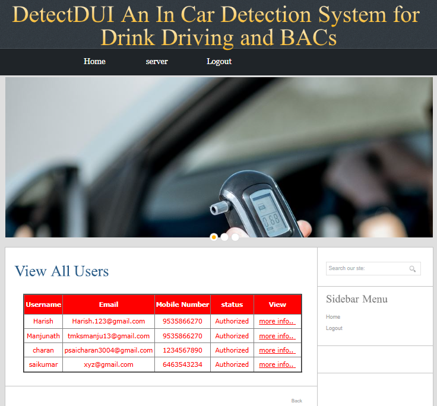

# Detect-DUI-an-in-car-detection-system-for-drink-driving-ad-BACS

<h2>Objective:</h2>

As one of the biggest contributors to road accidents and fatalities, drink driving is worthy of significant research attention. However, most existing systems on detecting or preventing drink driving either require special hardware or require much effort from the user, making these systems inapplicable to continuous drink driving monitoring in a real driving environment. In this paper, we present DetectDUI, a contactless, non-invasive, real-time system that yields a relatively highly accurate drink driving monitoring by combining  vital signs (heart rate and respiration rate) extracted from in-car WiFi system and driver’s psychomotor coordination through steering wheel operations. The framework consists of a series of signal processing algorithms for extracting clean and informative vital signs and psychomotor coordination, and integrate the two data streams using a self-attention convolutional neural network (i.e., C-Attention). In safe laboratory experiments with 15 participants, DetectDUI achieves drink driving detection accuracy of 96.6% and BAC predictions with an average mean error of 2 _ 5mg/dl. These promising results provide a highly encouraging case for continued development.

<h2>Softwares Installations:</h2>

<ul>
  <li>
    java version "1.8.0_161"
  </li>
  <li>
    apache-tomcat 9.0.2
  </li>
  <li>
    ecclipseOxygen
  </li>
  <li>
    mysql 5.0</li>
  <li>sqlyog657</li>
</ul>

<h2>Contents :</h2>
<ul>
  <li>Results2.jsp</li>
  <li>coin-slider.css</li>
  <li>style.css</li>
  <li>database.sql</li>
  <li>coin-slider.min.js</li>
  <li>cufon-times.js</li>
  <li>cufon-yui.js</li>
  <li>jquery-1.4.2.min.js</li>
  <li>script.js</li>
  <li>a_userdetails1.jsp</li>
  <li>A_View_AccuracyResults.jsp</li>
  <li>A_View_Age_Count_Results.jsp</li>
  <li>A_View_All_Datasets.jsp</li>
  <li>A_View_All_Datasets_By_Blockchain.jsp</li>
  <li>A_View_All_Datasets_By_Blockchain1.jsp</li>
  <li>A_View_All_Datasets1.jsp</li>
  <li>A_View_All_Users.jsp</li>
  <li>A_View_City_Count_Results.jsp</li>
  <li>A_View_Drinking_Type_Results.jsp</li>
  <li>A_View_User_Details.jsp</li>
  <li>A_View_Vehicle_Type_Results.jsp</li>
  <li>adminlogin.jsp</li>
  <li>adminmain.jsp</li>
  <li>authentication.jsp</li>
  <li>conformuser.jsp</li>
  <li>connect.jsp</li>
  <li>index.html</li>
  <li>profile_pic.jsp</li>
  <li>Results.jsp</li>
  <li>Results1.jsp</li>
  <li>Results3.jsp</li>
  <li>SensorCamera_Datasets.xls</li>
  <li>U_Find_Driving_Type_Results.jsp</li>
  <li>U_Find_Driving_Type_Results_By_Hashcode.jsp</li>
  <li>U_Find_Driving_Type_Results_By_Hashcode1.jsp</li>
  <li>U_Find_Driving_Type_Results1.jsp</li>
  <li>u_insertdata.jsp</li>
  <li>u_profiledetails.jsp</li>
  <li>u_register.jsp</li>
  <li>U_Upload_Datasets.jsp</li>
  <li>U_Upload_Datasets1.jsp</li>
  <li>userlogin.jsp</li>
  <li>usermain.jsp</li>
  <li>Work.txt</li>
  <li>wronglogin.jsp</li>
</ul>

<h2>Working:</h2>
<ul>
  <li>Download my repository.</li>
  <li>Make sure all the softwares are installed.</li>
  <li>Run the code in eclipse using apache as a local host </li>
  <li>Login as server and user and find the results</li>
</ul>

<h2>Theory  And Results:</h2>

<li>Design</li>

DetectDUI detects drink driving and predicts BAC through a driver’s vital signs and psychomotor coordination. Fig. 2 shows the architecture of DetectDUI. In DetectDUI, vital signs are tracked through a WiFi sensing system. The transmitter is a hotspot on a mobile phone, and the receiver is the on-board unit (OBU) of the car. Psychomotor coordination is measured by an IMU attached to the car’s steering wheel. The system comprises two main modules: a signal processing and fusion module, which prepares, cleans, processes, and fuses the two data streams, and a drink driving analyzer, which is responsible for extracting features, determining whether the driver is drunk, and producing BAC estimation. If the system determines a driver to be drunk, it issues an alert through the smartphone. Future real-world version of the system could be designed to adopt other actions in the case of emergency, e.g., taking over from the driver and placing the car in autonomous driving mode.

<li>A. Extracting Vital Signs</li>

Due to the complicated driving conditions, the in-car wireless transmission environment is noisy and unstable. The chest motions caused by breathing and heartbeat are subtle and easily contaminated by the interference. To obtain accurate vital signs from the received signals, we have carefully designed five steps to remove the interference and extract clear breathing and heartbeat patterns.

To begin with, we use a Hampel filter to smooth the signal by removing outliers with abnormally high or low amplitudes. Then, we leverage power delay profile to eliminate multipath effects since the in-car environment is compact and contains many reflection paths that interfere the direct reflection from the human body. After that, we adopt principal component analysis to distill and integrate important information of subcarriers. In the fourth step, we eliminate sudden changes due to bumpy driving conditions, which have an overlapping frequency range with vital signs and cannot be removed by previous three steps. Finally, we leverage adaptive variational mode decomposition to separate and recover patterns of breathing and heartbeat. These five steps work together to purify the noisy received signals and help restore accurate vital signs.

<li>1) Collecting CSI Data:</li>

Vital signs are derived from the minute chest motions caused by breathing and heartbeats recorded by an in-car WLAN as CSI signals. While RSS only provides the average power of WiFi signals, CSI is capable of capturing more information, e.g., fading and scattering in each narrowband subcarrier channel. We leverage the amplitude and phase of these subcarriers to extract subtle chest movements.

<li>2) Smoothing CSI Data:</li>

The CSI signals exhibit many glitches that result from factors like environmental noise and hardware imperfections. To remove these artifacts, we first adopt Hampel filter, which smooths the signals while preserving important information associated with chest motions. Applied to each subcarrier separately, the Hampel filter removes outliers that have an abnormally high or low amplitude. A data point hi is considered to be an outlier if the following condition is satisfied,
|hi−median(hi,K)|>δ×std(hi,K),(1)
.where median(hi,K) and std(hi,K) are the median and standard deviation of K neighboring samples of hi , and δ is a constant parameter. A detected outlier hi is replaced by median(hi,K) . K is the length of local windows.

</li>3) Eliminating Multipath Reflections:</li>

Ideally, we need only the direct reflection from the chest of the user for vital sign extraction. Unfortunately, the signals will also be reflected by other parts of the driver (e.g., head, arm), other passengers and car interiors (e.g., seat). Based on the fact that direct reflection has the shortest path, shortest delay and strongest power, we use power delay profile  to differentiate direct reflection from the chest and other multipath reflections.

CSI characterizes the frequency response of each subcarrier under orthogonal frequency-division multiplexing (OFDM), a technique adopted to improve spectrum utilization by commercial WiFi devices. The calibrated signals from the step above are first divided into time domains via an inverse fast Fourier transformation. The power PDP is calculated for each time interval as
ΔT=N/(F∗Cn∗2)
.where N=64 is the total number of subcarriers, F=40Mhz is the bandwidth of the WiFi signal, and Cn=60 is the number of collected subcarriers. 
 A delay of over 500ns is deemed as multipath reflections in the indoor environment. Since the in-car environment is narrower than the indoor environment, we find that a delay threshold of 300ns is suitable. Any paths with a delay over 300ns are deemed to be multipath reflections and removed.

Fig.  displays the subcarrier that has been processed by the Hampel filter before and after multipath elimination. We can observe that before multipath removal, the signal is a mixture of multipath reflections, which blur the chest movement pattern. Specifically, the peaks and valleys are hazy before multipath elimination and becomes sharp after multipath elimination. 

<li>4) Principal Component Analysis:</li>

 the variations in each subcarrier is caused by chest motions. Thus, the information carried by subcarriers are highly correlated and contains redundancy. In addition, subcarriers with different frequencies (i.e., different ID numbers) have different sensitivities to the subtle chest motions. Some subcarriers are sensitive to chest motions and bear rich information of vital signs, while some subcarriers are insensitive to chest motions and contains mostly noises. Therefore, we need to integrate information of subcarriers in a way that keeps useful information and removes redundancy and interference.

In existing works on vital sign monitoring,  selects a single subcarrier with the largest variance and ignores all other subcarriers, which leads to potential information loss. Instead, we leverage principal component analysis , an effective way of integrating and denoising highly-correlated data.

To identify the principal components, we compute
P=D∗eig(cov(D)),(3)
.where D is a len∗60 matrix that contains data of all subcarriers, len is the number of samples in each subcarriers, 60 is the number of collected subcarriers, cov(D) is the covariance matrix of D , and eig(cov(D)) is the eigenvector of cov(D) . Each column of P represents a principal component, and we select the first principal component with the largest variance. The selected principal component is normalized since the amplitude of signals can become very large after PCA.

<li>5) Removing Sudden Changes:</li>

Different from indoor environments, in-car environments provide poorer conditions for wireless transmissions. Interruptions due to poor driving conditions, interference from bumps in the road, and other surrounding disturbances are inevitable. These interruptions usually have large amplitudes but low frequencies that overlap with the frequency of chest motions, thus cannot be removed by the previous steps. Our strategy is to divide the signal into time windows and eliminate window that contains sudden unexpected changes, leaving only periods of relative stable signals. This is done with Algorithm 1.

Algorithm 1 Sudden Change Removal (SCR)

</li>6) Adaptive Variational Mode Decomposition:</li>

Until now, we have got a relatively clean signal after intensive interference removal thanks to the previous four steps, as shown in Fig. 6. However, even though the signal demonstrates clear cycles that corresponds to breath patterns, the information of heartbeat is imperceptible due to its much weaker amplitude. Furthermore, there will be noises from the in-car environment in the processed signal [26]. The frequency of heartbeat, breathing, the noises from the in-car environment, thus the vital signs cannot be separated using filters. The challenge now is how to separate the noises introduced by the in-car environment from the vital signs.

A potential solution to this problem is to decompose the mixed signal into different modes of spectral bands, and Empirical Mode Decomposition (EMD) has been widely used in existing works on similar problems [33]. Nonetheless, the recursive nature of EMD makes it suffer from noises. To address this difficulty, we resort to a more advanced signal decomposition approach, variational mode decomposition (VMD) [34], which is non-recursive and outperforms many other mode decomposition methods.

However, the number of decomposed modes affect each mode’s central frequency and narrow bandwidth, resulting in reduced detection accuracy of breathing and heartbeat. To solve this problem, we design a novel adaptive variational mode decomposition (AVMD) approach to adaptively determine the numbers of decomposed modes. First, AVMD decomposes the time-series signal B(t) into K sub-signals (modes) via an intrinsic mode function (IMF) [34],
B(t)=∑k=1Kuk(t),(5)
View SourceRight-click on figure for MathML and additional features.where uk(t) is the k -th mode.

Similar to the conventional VMD algorithm, we need three steps to estimate the bandwidth of each IMF. First, the analytic signal for each mode is computed. Then, the modes are mixed with an exponential to shift their frequencies to the baseband. Finally, the bandwidth of each mode is estimated via the squared L2 norm of the gradient. The constrained variational problem can be expressed as
minuk,wk  ∑k=1K∥∥∥∥∥∂[(δ(t)+jπt)∗uk(t)]∗e−jwkt∂t∥∥∥∥∥22 s.t. B(t)=∑k=1Kuk(t).(6)
View SourceRight-click on figure for MathML and additional features.where j2=−1 , wk is the center frequency of mode uk(t) , and δ(t) is a Dirac delta function.

The constrained variational problem in (6) can be solved using alternate direction method of multipliers ADMM [34].

The complete AVMD algorithm is described in Algorithm 2. Lines 3 and 4 update the modes and their center frequencies. In Equation (7), b^(ω) is the frequency-domain presentation of the filtered signal. λ is a quadratic penalty term [34]. α is the variance of white noise. The Hilbert transform for u^k is calculated in line 5, based on which the instantaneous frequency uif(k) is computed in line 6 and the mean instantaneous frequency mif(k) is computed in line 7. The curvatures IC is derived according to mif(k) in line 8. The penalty term λ is updated in line 11 based on an update rate β , and the convergence condition is given in line 12.

Algorithm 2 Adaptive Variational Mode Decomposition
Input:

<li>B. Measuring Psychomotor Coordination</li>

Although vital signs are important indicators of drink driving, we further measure the psychomotor coordination of drivers to improve prediction accuracy. Existing behavior-based drink driving detection methods mostly adopt smart devices to passively monitor user movements or actively require user interactions. Nevertheless, these methods are not applicable to the driving condition since it is unlawful for drivers to play with smartphones while driving. Instead, we have designed a novel way to monitor psychomotor coordination by monitoring the driver’s operations of the steering wheel during driving using IMU deployed on the steering wheel. Many car manufactures have already deployed IMU in their cars to monitor the status of the car but not the human. In the future, we expect that IMU will be deployed on the steering wheel to help track the status of the driver. In this way, we realize a continuous non-interrupting monitoring in a user-friendly way.

The IMU on the steering wheel captures the angular velocity G(t) and acceleration A(t) of the driver’s operations. Compared with WiFi signals that are easily interfered during transmission, IMU data is relatively stable. We process the IMU data in two steps.

First, we clean the data using a low-pass Butterworth filter to eliminate high-frequency noise. Since most human body movements are within the range of 0 ~ 20Hz [36], we set the cutoff frequency as 40Hz.

Then, we segment the data so that each data segment corresponds to a single steering wheel operation. The key to data segmentation is to pinpoint the start and the end of each operation. We leverage the gyroscope signal rather than the acceleration signal for data segmentation due to the following reason. If the driver turns the steering wheel slowly and smoothly, the acceleration signal shows very small fluctuations. But as the direction of the steering wheel alters, the gyroscope signal will exhibit clear changes. When there is no steering wheel operation, the car is going straight, thus the z -axis of the gyroscope is zero. If the driver turns the steering wheel to the left or the, the angular velocity of the car changes, which is reflected by the z -axis data of the gyroscope. In our experiment, we decide that an operation starts if the z -axis reading of the gyroscope is greater than 0.01rad/s and the operation ends when the reading returns to zero. The acceleration data is synchronized with the gyroscope data so that we segment the acceleration data accordingly.

<li>C. Extracting Features</li>

After signal pre-processing, we extract the most informative features from the signals for drink driving detection. To account for both vital signs and psychomotor coordination, we compute the following features.

Vital Signs: Breath rate and heartbeat rate.

Psychomotor Coordination:

Time-domain features, including statistics (mean, median, min, max, standard deviation, variance), skewness (the third moment), and coefficient of variation (the ratio of the standard deviation to the mean multiplied by 100).

Frequency-domain features, including energy and the square sum of the frequency spectrum related to steering operations.

To confirm that the extracted features are indicative factors of drink driving, we conduct a comprehensive correlation analysis on the relationship between individual features and BAC. Pearson’s correlation analysis is used to analyze linear correlation, with ±1 representing strong positive/negative linear relationship while 0 representing no linear relationship. Spearman’s rank correlation coefficient is used to characterize monotonic relationship, with ±1 indicating monotonically increasing/decreasing relationship, and 0 indicating no monotonic relationship. Kendall rank correlation is used to test similarity, with ±1 representing consistent positive/negative rank correlation, and 0 means no such relationship.We further analyzed the influence of each feature on the model in terms of Gini coeffient, which reflects the purity of the features, calculated as

<li>D. Detecting Drink Driving
</li>

Given the carefully extracted vital signs and psychomotor coordination features, we need a well-performed classifier to determine whether the driver is sober or drunk. As discussed , different features have different contributions in predicting drink driving and BAC. The problem is how to combine information from vital signs and psychomotor coordination effectively for drink driving detection. The detection model should also be lightweight to be deployed in an in-car system. To solve this problem, we propose a C-Attention network with attention mechanism . The self-attention mechanism in the C-Attention network explores the relationship between any two features, resulting in a holistic integration of the vital signs and psychomotor coordination information. The self-attention mechanism of C-Attention also requires less computational resources than traditional CNN. Furthermore, to improve the predictive power of the model without increasing model complexity, the C-Attention network introduces a stack of N one-dimensional convolution layers. In our experiments in , we have compared the C-Attention network with commonly-used machine learning algorithms and demonstrated that C-Attention network has the highest prediction accuracy.

Input Block: The input block comprises the positional embedding layer and a stack of N one-dimensional convolution layers. The positional embedding layer contains two trainable sublayers: one transfers the features to tokens, and the other assigns indexes to the tokens . With position embedding layers, C-Attention network takes position information of input features into consideration and explores the relationship between features. To optimize the embedding vector derived from the position embedding layer, C-Attention network adds a stack of N one-dimensional convolution layers. In our implementation, we set N=3 .

Transformer Block: The transformer block consists of two sub-layers: a multi-head self-attention block and a feed-forward network. After each sub-layer, there is a dropout layer, and the dropout rate is 0.1.

The output of the multi-head self-attention block is
MultiHead(Q,K,V)=Concat(head1,…,headn)WO,
where,
headi=Attention(QWQi,KWKi,VWVi),
View SourceRight-click on figure for MathML and additional features.where WQi∈Rdmodel∗dk , WKi∈Rdmodel∗dk , WVi∈Rdmodel∗dv and WO∈Rhdv∗dmodel . n is the number of parallel heads. In our implementation, we set n=4 , and dk=dv=dmodel/n=4 .

At each of the two sub-layers, we utilize a residual connection  in the transformer block, followed by a normalization layer, presented as “Add & Norm” .

Output Block: The output block contains a pooling layer and a fully connected layer. After each layer, there is a dropout layer, and the dropout rate is 0.2. The output block produces a binary value predicting the state of the driver, i.e., sober or drunk, derived from a self-attention matrix by a sigmoid function as
Attention(Q,K,V)=softmax(QKTdk−−√)V,
View SourceRight-click on figure for MathML and additional features.where Q is the result of a set of queries calculated by the attention function, K and V are the keys and values, ∗T is matrix transformation, and 1dk√ is a scaling factor.

The multi-head attention mechanism in the C-Attention model assigns different weights to different elements of the input so that features of different importance can be leveraged to reach an accurate prediction result. Moreover, the depth of the C-Attention network is relatively small, thus its computational and storage costs are low, making it suitable for the on-board computing system of automobiles. In the experiments, we compare the performance of C-Attention model and other commonly used classification models, and confirm its superiority in achieving higher prediction accuracy.

In our implementation of the C-Attention model, the input feature map size is 1 * 20. The output feature map size of the positional embedding is 20 * 16, and the output feature map sizes of the 3 convolution layers is 20 * 64, 20 * 32, and 20 * 16, respectively. The output feature map size of the transformer block is 20 * 16. The output feature map size of the fully-connected layer in the output block is 1 * 20. A sigmoid function is applied to the output of the fully-connected layer to yield the final prediction result.

<li>E. Predicting BAC Level
</li>

To further investigate how drunk the driver is, we conduct a more precise BAC level prediction. Deep learning networks, though being applied to many other scenarios, are not suitable for our application for two main reasons. First, the feature space and the data size are much smaller than those of image processing or speech recognition. Deep learning networks usually suffer from overfitting problems in the case of small training dataset and feature space. Second, deep learning networks usually have prohibitively high overheads, and not resource-effective for the in-car system. Therefore, we resort to lightweight learning algorithms for BAC prediction.

<li>Home Page:</li>

<li>User Registration:</li>

<li>Login Page:</li>

<li>User Home Page:</li>

<li>Server Home Page:</li>

<li>Server Authorise and View Users:</li>

<li>Datsets Protected by Blockchain:</li>

<li>User uploading Datasets:</li>

<li>Uploaded Datasets:</li>

<li>Finding Drunk or NOt by Data:</li>

<li>Result:</li>

<li>Finding Drunk or NOt by Hash Code:</li>

<li>Result:</li>

<li>Graphs of the Data:</li>

